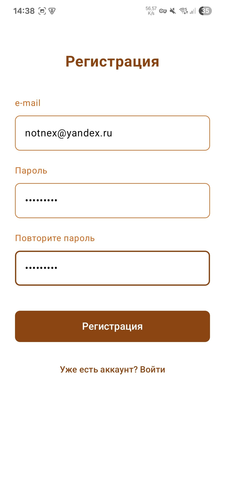
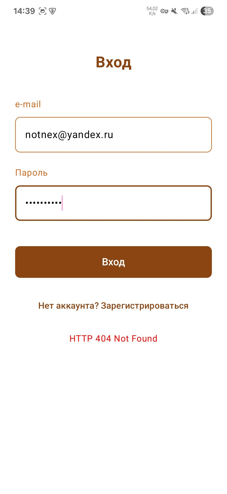
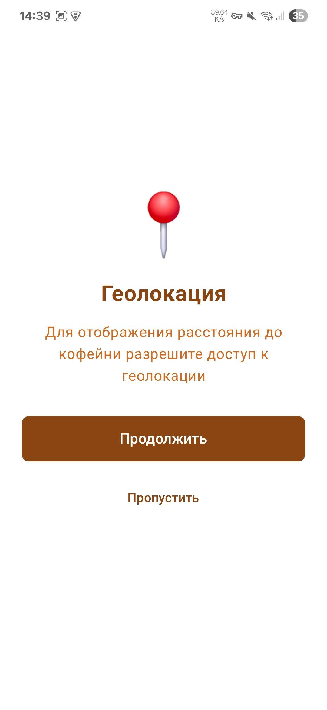
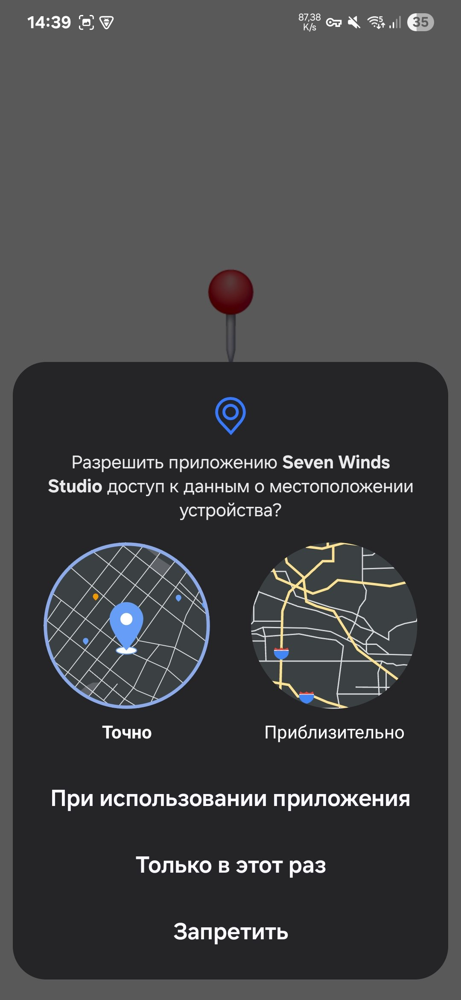
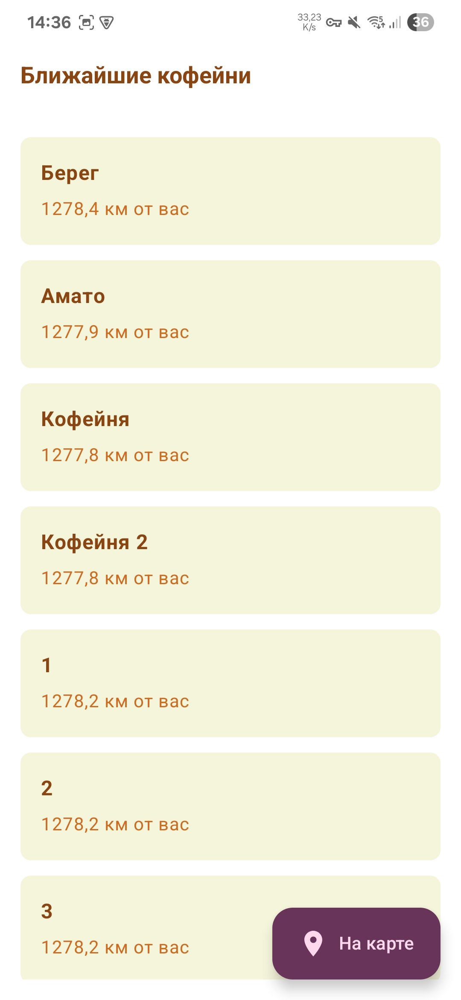
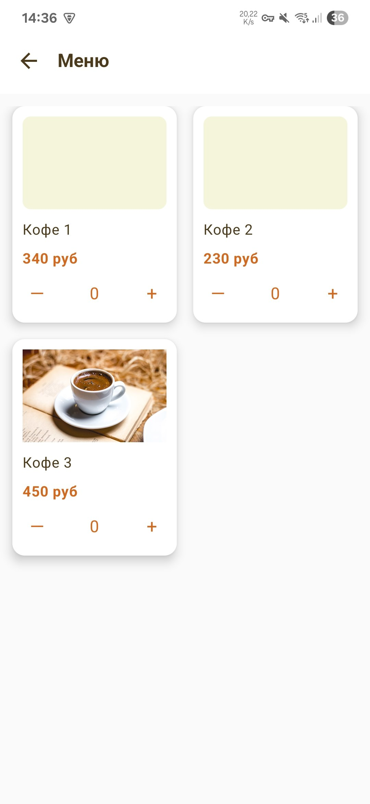
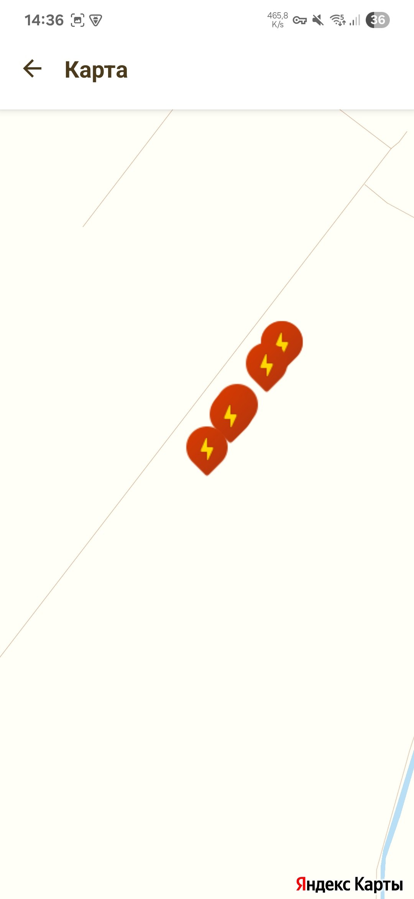
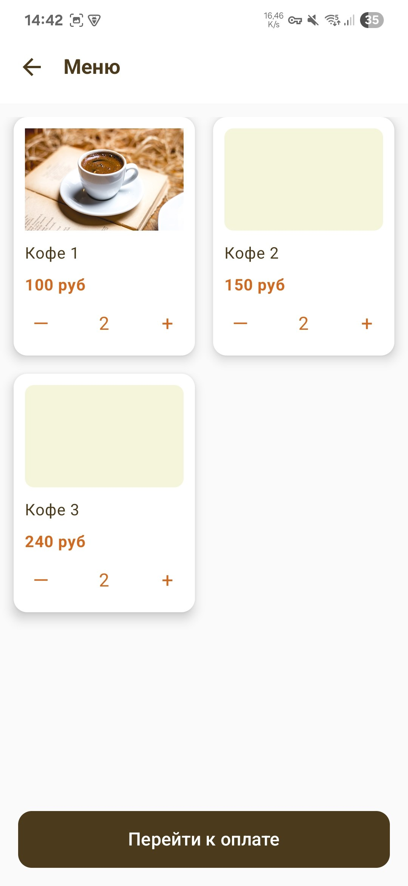
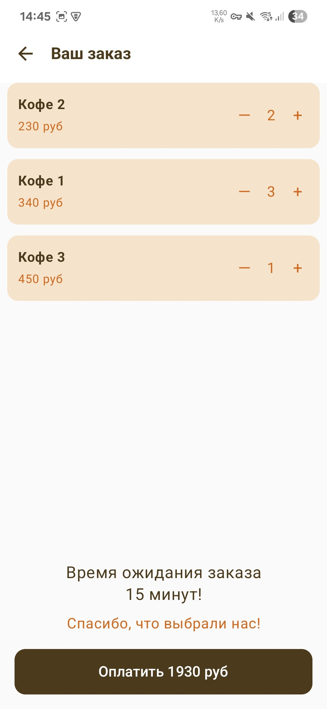
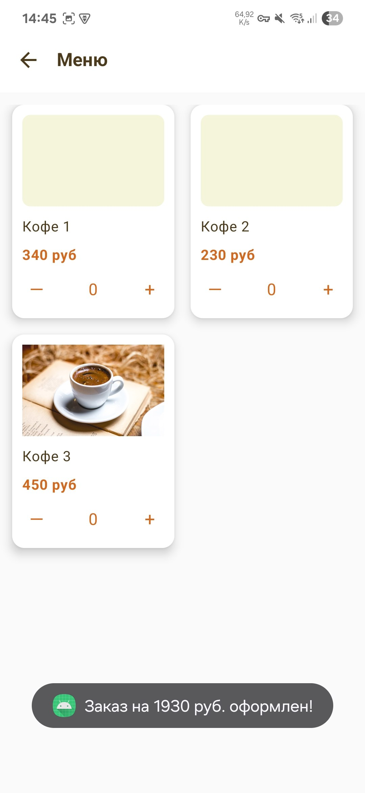

# Seven Winds Studio - Coffee Shop App

Мобильное приложение для заказа кофе в кофейнях, разработанное с использованием современных Android технологий.

## Технологии

- **Язык программирования**: Kotlin
- **UI Framework**: Jetpack Compose
- **Архитектура**: MVVM (Model-View-ViewModel)
- **Навигация**: Navigation Component
- **Сетевые запросы**: Retrofit2 + OkHttp
- **Асинхронность**: Coroutines + Flow
- **Загрузка изображений**: Coil
- **Геолокация**: Google Play Services Location
- **Карты**: Yandex Maps

## Функциональность

### Экран 1: Регистрация
- Форма регистрации с валидацией email и пароля
- API: `POST /auth/register`
- Поля: `login` (email), `password`

### Экран 2: Вход
- Форма входа в систему
- API: `POST /auth/login`
- Поля: `login` (email), `password`

### Экран 3: Ближайшие кофейни
- Список кофейни с расстоянием от пользователя
- API: `GET /locations` (требует авторизации)
- Дополнительно: отображение расстояния с использованием геолокации
- Поддержка swipe-to-refresh (обновление списка свайпом вниз)

### Экран 4: Карта кофейни
- Отображение кофейни на карте (заглушка для Яндекс Карт)
- Те же данные, что и на экране 3

### Экран 5: Меню
- Отображение меню выбранной кофейни
- Возможность добавления товаров в корзину
- API: `GET /location/{id}/menu` (требует авторизации)

### Экран 6: Ваш заказ
- Просмотр выбранных товаров
- Возможность изменения количества
- Информация о времени ожидания

## Структура проекта

```
app/src/main/java/com/notnex/sevenwindsstudio/
├── data/
│   ├── api/
│   │   ├── ApiService.kt
│   │   ├── NetworkModule.kt
│   │   └── AuthInterceptor.kt
│   ├── model/
│   │   ├── AuthModels.kt
│   │   └── LocationModels.kt
│   └── repository/
│       └── CoffeeRepository.kt
├── presentation/
│   ├── navigation/
│   │   ├── AppNavigation.kt
│   │   └── Screen.kt
│   ├── screens/
│   │   ├── LoginScreen.kt
│   │   ├── LocationsScreen.kt
│   │   ├── MapScreen.kt
│   │   ├── MenuScreen.kt
│   │   ├── OrderScreen.kt
│   │   └── RegisterScreen.kt
│   └── viewmodel/
│       ├── AuthViewModel.kt
│       ├── LocationsViewModel.kt
│       └── MenuViewModel.kt
└── MainActivity.kt
```

## API

Базовый URL: `http://212.41.30.90:35005/`

### Эндпоинты:

#### Авторизация (не требует токена):
- `POST /auth/register` - Регистрация
  - Request: `{"login": "email", "password": "password"}`
  - Response: `{"token": "string", "tokenLifeTime": number}`
- `POST /auth/login` - Вход
  - Request: `{"login": "email", "password": "password"}`
  - Response: `{"token": "string", "tokenLifeTime": number}`

#### Объекты (требуют токен авторизации):
- `GET /locations` - Список кофейни
  - Response: `[{"id": number, "name": "string", "point": {"latitude": number, "longitude": number}}]`
- `GET /location/{id}/menu` - Меню кофейни
  - Response: `[{"id": number, "name": "string", "imageURL": "string", "price": number}]`

### Авторизация:
- Все запросы к объектам требуют токен в заголовке `Authorization: Bearer {token}`
- Токен автоматически добавляется после успешной регистрации/входа

## Локализация

- Все пользовательские строки вынесены в ресурсы (`strings.xml`).
- Поддерживаются русский и английский языки (values/strings.xml и values-en/strings.xml).
- Для добавления нового языка — создайте соответствующий файл ресурсов и переведите строки.
- В коде используется `stringResource(R.string.key)` (Compose) или `context.getString(R.string.key)` (ViewModel/не Compose).

## Установка и запуск

1. Клонируйте репозиторий
2. Откройте проект в Android Studio
3. Синхронизируйте Gradle файлы
4. Запустите приложение на эмуляторе или устройстве

## Особенности реализации

- **MVVM архитектура**: Четкое разделение ответственности между слоями
- **Jetpack Compose**: Современный декларативный UI
- **StateFlow**: Реактивное управление состоянием
- **Navigation Component**: Типобезопасная навигация
- **Retrofit**: Типобезопасные сетевые запросы
- **Coroutines**: Асинхронная обработка данных
- **Material Design 3**: Современный дизайн
- **Автоматическая авторизация**: Токен добавляется автоматически к запросам

## Дополнительные возможности

- Валидация форм
- Обработка ошибок сети
- Индикаторы загрузки
- Поддержка геолокации
- Заглушка для интеграции с Яндекс Картами
- Автоматическое управление токенами авторизации
- **Swipe-to-refresh**: обновление списка кофеен и расстояний свайпом вниз на главном экране

## Автор

Разработано для тестового задания Seven Winds Studio 

## Изменения и доработки

- Интегрирована Яндекс.Карта на отдельном экране (MapActivity) с использованием MapKit.
- Добавлено отображение всех кофеен на карте с помощью PNG-иконки (маркер).
- Исправлена проблема с невидимыми маркерами: теперь используются только PNG-иконки подходящего размера (например, marker.png).
- Удалены тестовые маркеры и временные логи, оставлено только отображение реальных кофеен.

## Советы по иконкам маркеров
- Для маркеров используйте только PNG/JPG/BMP-иконки размером до 128x128 px.
- Vector Drawable (XML) и SVG не поддерживаются для маркеров в Яндекс.Картах. 

## Скриншоты

<p align="center">
  
  
  
  
  
  
  
  
  
  
</p> 